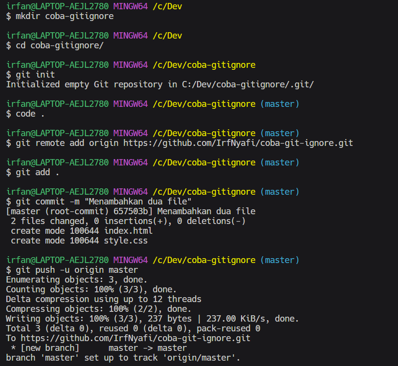
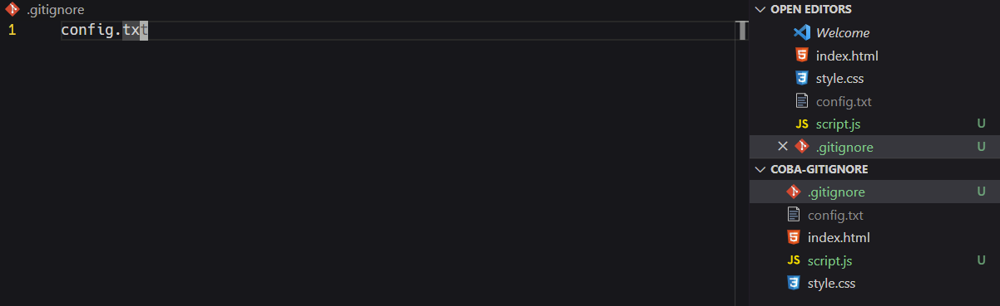
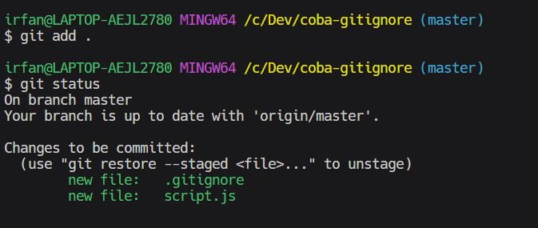

# GitIgnore

Berikut adalah link sumber materi 12 ->
[Link Video 12](https://www.youtube.com/watch?v=LK3kX4n-vLM&list=PLFIM0718LjIVknj6sgsSceMqlq242-jNf&index=12)

## Table of Contents
  - [Apa Itu Gitignore](#apa-itu-gitignore)
  - [Contoh Gitignore](#contoh-gitignore)

## Apa Itu Gitignore
Gitignore adalah sebuah file yang tujuannya adalah untuk mengisolasi atau memberikan daftar kepada git untuk mengabaikan file-file tertentu sehingga ketika kita melakukan commit (jika terdapat file-file yang tidak perlu) maka tidak semua file akan di commit.

## Contoh Gitignore
1. Buatlah sebuah repository pada GitHub
2. Buatlah sebuah repository pada komputer lokal Anda
3. Tambahkan file-file kemudian lakukan staging dan commit
4. Push-lah file-file dari komputer lokal Anda ke dalam GitHub

5. Sebagai contoh, tambahkanlah dua file, yaitu script.js dan config.txt. Andaikan Anda diminta untuk push script.js, tetapi config.txt tidak boleh terikut terkirim maka untuk menyelesaikan masalah tersebut, buatlah file .gitignore
6. Pada file .gitignore, cantumkan file-file yang tidak ingin ikut terkirim

7. jalankan kedua command tersebut
```
git add .
```

```
git status
```

Perhatikan bahwa pada proses staging, file config.txt tidak termasuk ke dalamnya

tak hanya itu, gitignore juga bisa digunakan untuk folder atau sebuah pola, contohnya sebagai berikut
```
<file-path>/

*.exe
```