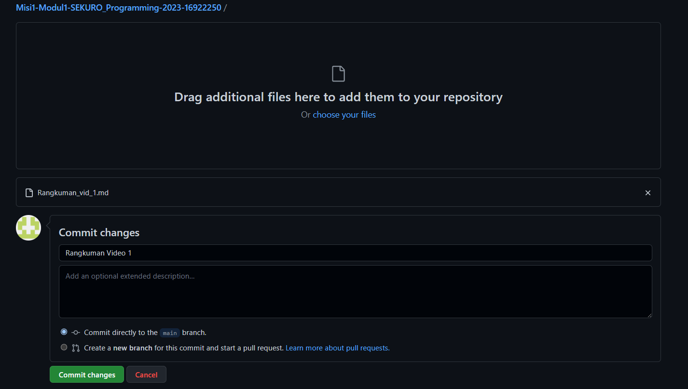

# Bekerja Dengan GitHub (Video 2)

Berikut adalah link sumber materi 2 ->
[Link Video 2](https://www.youtube.com/watch?v=Q3Id0DgcrXY&list=PLFIM0718LjIVknj6sgsSceMqlq242-jNf&index=3&ab_channel=WebProgrammingUNPAS)

## Table of Content
  - [Tata Cara Pembuatan Akun GitHub](#tata-cara-pembuatan-akun-github)
  - [Tata Cara Pembuatan Repository](#tata-cara-pembuatan-repository)
  - [Tata Cara Upload file ke Repository](#tata-cara-upload-file-ke-repository)

## Tata Cara Pembuatan Akun GitHub
1. Kunjungi website [GitHub](https://github.com/)
1. Pilih menu Sign Up
1. Daftarkan email, password, dan username.
1. Isilah data-data yang diminta oleh GitHub
1. GitHub akan mengirimkan email verifikasi kepada Anda dan silahkan diverifikasi
1. Akun Anda sudah siap dan Anda bisa sign in dengan akun tersebut

## Tata Cara Pembuatan Repository
1. Buka website GitHub dan sign in dengan akun yang sudah dibuat
2. Pada halaman home, klik menu "tambah" dan pilih menu "New repository"
   
3. Isi nama repository, deskripsi, dan tentukan scope dari repository-nya, yaitu public atau private.

4. Klik "Create repository"

## Tata Cara Upload file ke Repository
1. Pilih menu Add file dan klik tombol Upload files

1. Tambahkan file dan beri pesan commit

2. Klik tombol Commit changes
