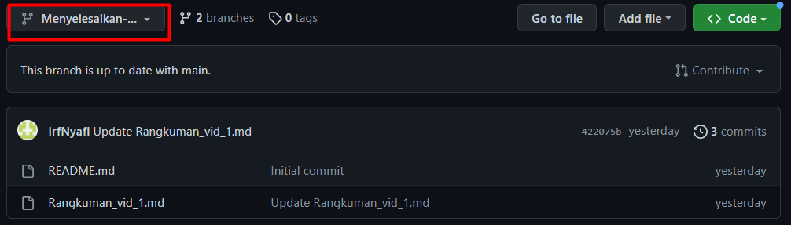
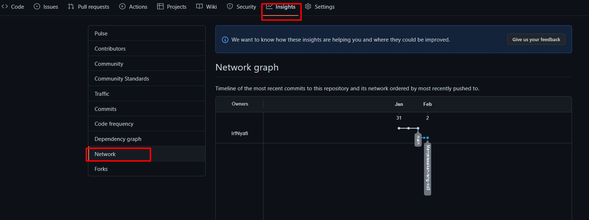
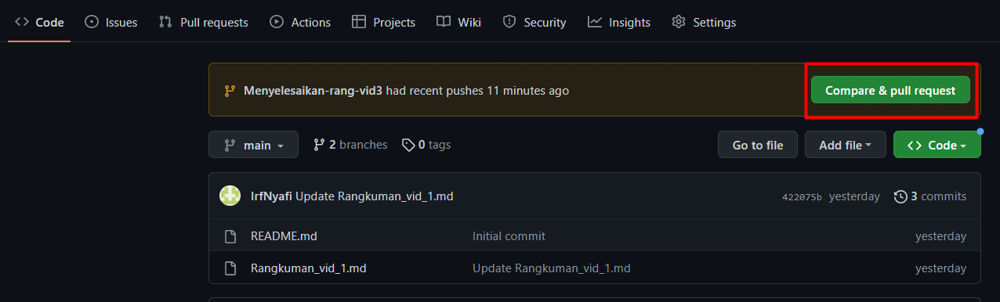
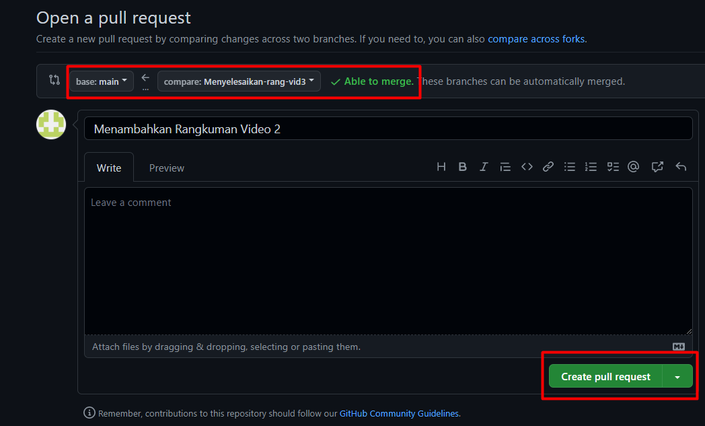
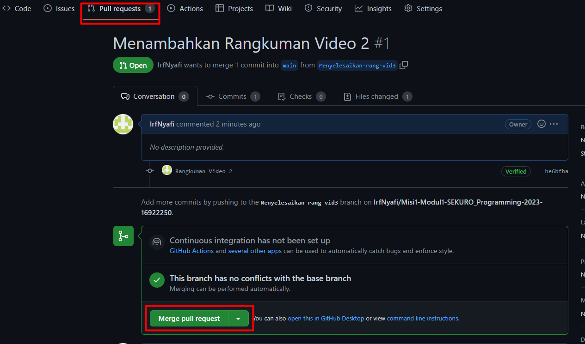
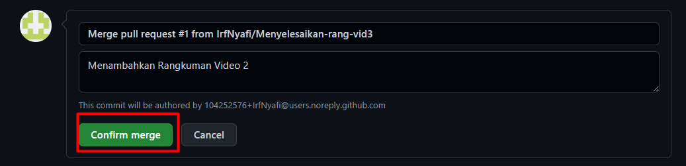
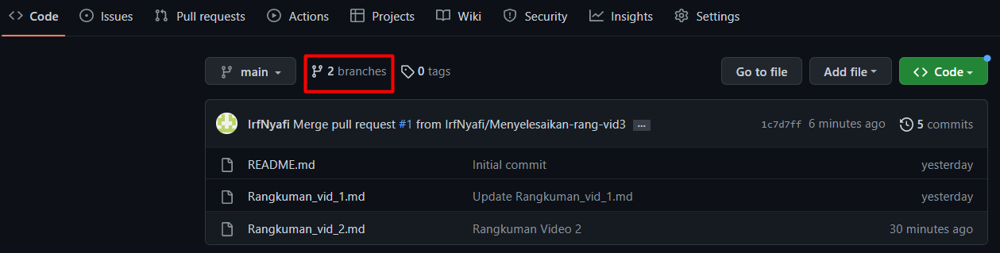
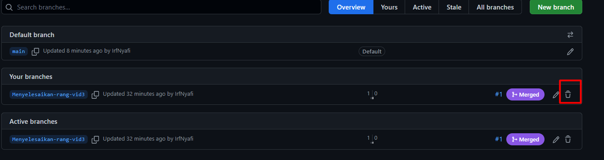

# GitHub: Branch

## Table of Contents
  - [Apa Itu Branch](#apa-itu-branch)
  - [Tata Cara Branching](#tata-cara-branching)
  - [Workflow pada Branch](#workflow-pada-branch)

 

## Apa Itu Branch
Branch dalam Git atau GitHub dapat dibayangkan sebagai garis development pada sebuah repository. Artinya dalam mengedit file, kita bisa membuat cabang baru sehingga perubahan-perubahan yang terjadi pada file tersebut tidak akan merusak branch utama. Perubahan pada salah satu branch tidak akan merusak branch yang lainnya karena setiap branch memiliki modifikasi dan commit-nya masing-masing. 
 
Kegunaan utama dari fitur branch adalah untuk membuat fitur-fitur yang sifatnya masih experimental. Tak hanya itu, fitur branch juga memungkinkan kita untuk bekerja secara berkelompok dengan lebih efisien. Hal tersebut dapat terjadi karena dengan branching, beberapa orang dapat mengerjakan atau mengedit file pada repo yang sama dengan branch yang berbeda-beda.

## Tata Cara Branching
1. Buka website GitHub dan buka salah satu repository yang ingin Anda branching
2. Klik tombol "main"
3. Pada text box yang muncul, untuk membuat branch baru maka ketiklah nama branch-nya dan kliklah pilihan "create branch"
   
4. Pembuatan branch berhasil jika anda melihat pada menu "branch:" sudah berganti namanya dari main menjadi nama branch yang baru

## Workflow pada Branch
Anda bisa membuat file baru atau Anda bisa upload file ke branch (tata cara upload file tidak berubah dan sudah dijelaskan pada rangkuman file ke-2). Setelah Anda melakukan perubahan pada branch, Anda dapat melihat 'garis development' atau history development pada menu Insights dan pilih menu Network

Setelah Anda Puas dengan perubahan yang telah dilakukan pada branch maka Anda bisa merging branch tersebut ke branch utama.

<b>Tata Cara Merging</b>

1. Pada page code, terdapat tombol compare & pull request. Kemudian tekan tombol tersebut

2. Pastikan branch yang dipilih sudah benar dan terdapat status Able to merge
3. Isilah pesan pada text box pesan
4. Klik tombol create pull request

5. Pada page Pull requests, klik tombol Merge pull request

6. Jika Anda sudah yakin dengan permintaan pull request maka klik tombol confirm merge

Setelah Anda Merging, Anda dapat menghapus branch sebelumnya jika branch tersebut sudah tidak akan Anda pakai

<b>Tata Cara Mengahapus Branch</b>

1. Pada page Code, klik menu branches

2. Pada branch yang ingin Anda hapus, terdapat icon tong sampah. Kliklah icon tersebut

