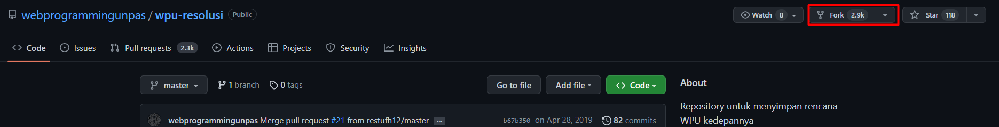
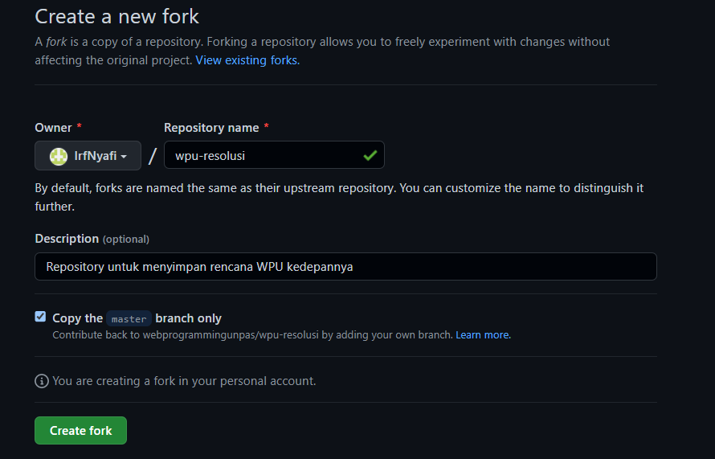
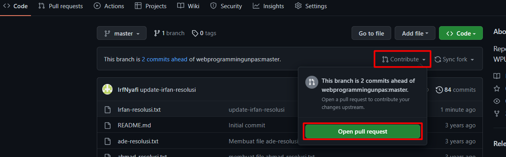
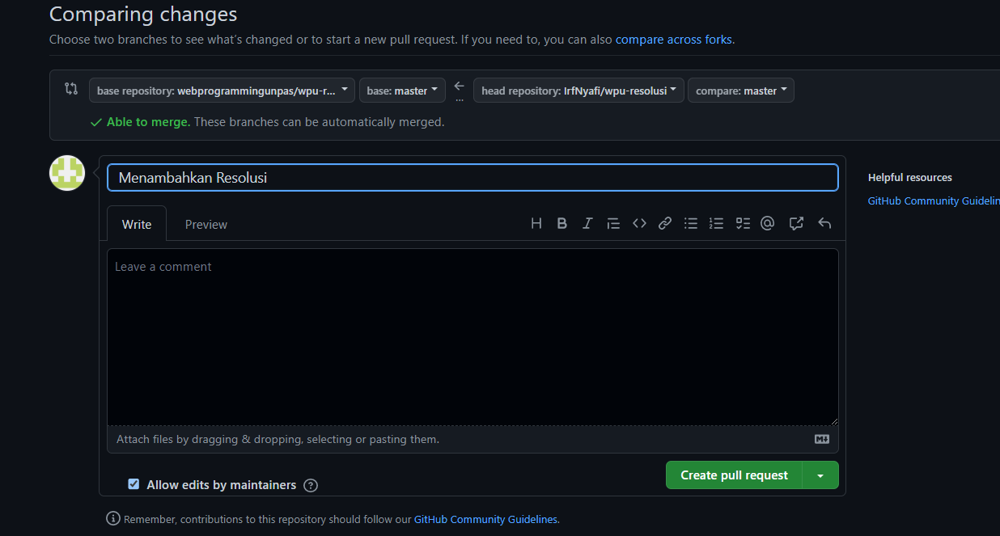

# GitHub: Fork

Berikut adalah link sumber materi 4 ->
[Link Video 4](https://www.youtube.com/watch?v=8rry2ncZmfg&list=PLFIM0718LjIVknj6sgsSceMqlq242-jNf&index=4)

## Table of contents
  - [Apa Itu Fork?](#apa-itu-fork)
  - [Tata Cara Melakukan Fork](#tata-cara-melakukan-fork)

## Apa Itu Fork?
Fork dalam Git atau GitHub adalah proses membuat copy/duplikat dari repo orang lain (beserta history-nya). Dalam pengaplikasiannya, fork biasa digunakan untuk berkontribusi pada projek open source karena fitur fork memungkinkan kita untuk membuat duplikat terhadap repo orang lain sehingga perubahan-perubahan yang akan kita buat tidak akan merusak repository aslinya. Kemudian setelah kita selesai mengedit repository tersebut, kita bisa mengirimkannya dengan "pull request".
  
Beberapa hal yang perlu diperhatikan bahwa fork berbeda dengan clone. fork adalah proses menduplikat repository orang lain ke repository kita, sedangkan clone adalah proses menduplikat repository oran lain ke komputer lokal kita.

## Tata Cara Melakukan Fork
1. Buka website GitHub dan bukalah repository yang ingin kita fork
2. Pada page code, klik tombol Fork

3. Konfirmasi untuk membuat fork

4. Silahkan edit repository yang di-fork
5. Setelah selesai mengedit repository, Anda bisa berkontribusi dengan melakukan pull request

6. Konfirmasi dan tambahkan pesan pull request
