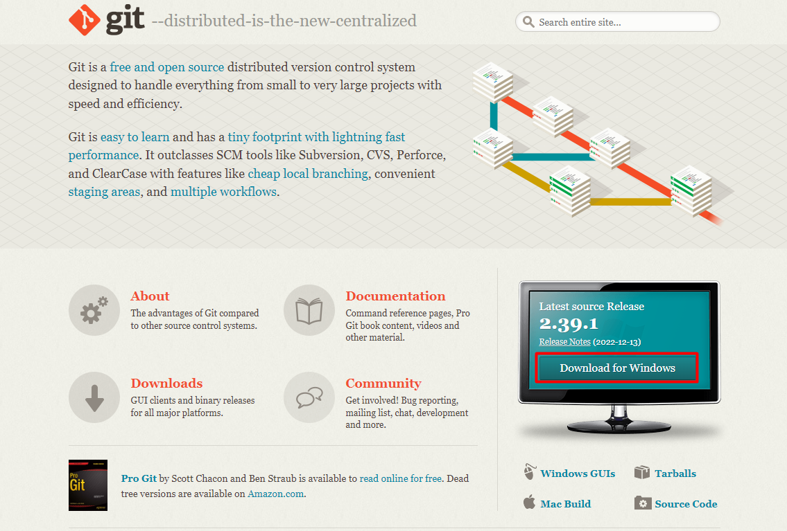
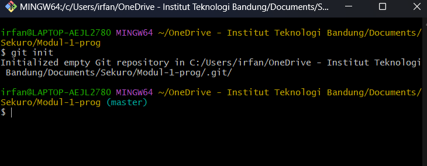
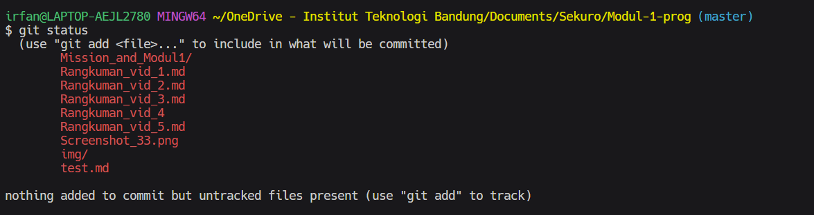
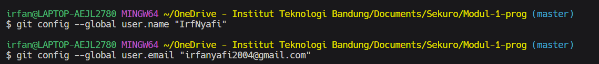

# Bekerja dengan Git

## Table of Contents

## Instalasi Git
1. Silahkan kunjungi [Link](https://git-scm.com/) tersebut untuk menuju ke page downloadnya
2. Silahkan download berdasarkan Operating System yang Anda punya

3. Setelah download, silahkan lakukan instalasi

## Tiga Area pada Repo Git
- <b>Working Tree</b>
  <br>
  Working tree adalah area di mana Anda dapat melakukan day-to-day development dan membuat perubahan pada file-file Anda. 
- <b>Staging Area</b>
  <br>
  Staging area adalah tempat untuk menyimpan sementara dari perubahan file-file yang telah Anda buat. Staging area berfungsi untuk meninjau dan menyusun perubahan sebelum menjadi bagian permanen dari project history.
- <b>History</b>
  <br>
  History merujuk pada catatan lengkap dari perubahan-perubahan yang telah dibuat pada repository. Catatan tersebut termasuk history semua komit beserta informasi siapa dan kapan perubahan tersebut dibuat.

## Workflow Git
Pada komputer lokal Anda, bukalah git bash. Selanjutnya, buka direktori yang ingin diintegrasikan dengan git. Gunakan command berikut untuk merubah direktori
``` sh
cd <path directory>
```

Untuk mengubah direktori menjadi repo git gunakan command

```
git init
```
(contoh screenshot)


Silahkan buat file baru atau melakukan pengeditan pada file yang sudah ada dalam repo. Untuk melihat status file-file yang sudah diedit, gunakan command berikut

```
git status
```

(contoh screenshot)


Langkah selanjutnya adalah merubah file-file menuju staging area. Untuk merubah file-file ke dalam staging area gunakan command berikut

```
git add <nama file>
```

jika Anda berurusan dengan banyak file dan ingin memindahkan semua file menuju staging area maka gunakanlah command berikut

```
git add .
```

Setelah file-file berada pada staging area maka langkah selanjutnya adalah melakukan commit. Akan tetapi, kita harus melakukan konfigurasi terlebih dahulu informasi akun git kita sehingga git mengetahui siapa yang sedang melakukan commit. Gunakan command berikut

```
git config --global user.name "nama Anda"
git config --blobal user.email "email Anda"
```

(contoh screenshot)


Langkah selanjutnya adalah melakukan commit. Berikut adalah command yang digunakan untuk commit

```
git commit -m "Pesan Commit"
```

flag -m menandakan pesan