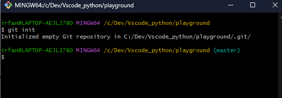
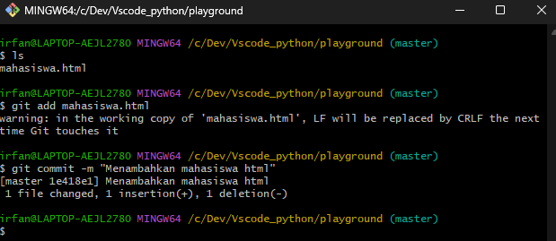
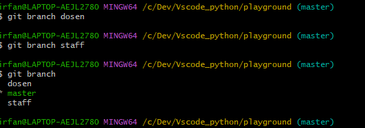
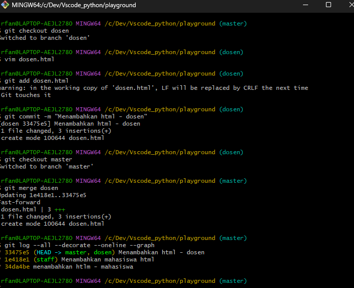
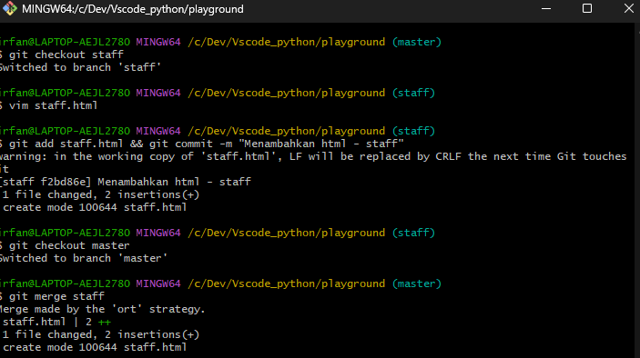
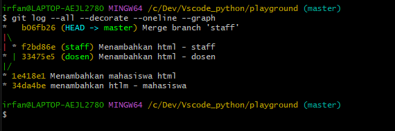
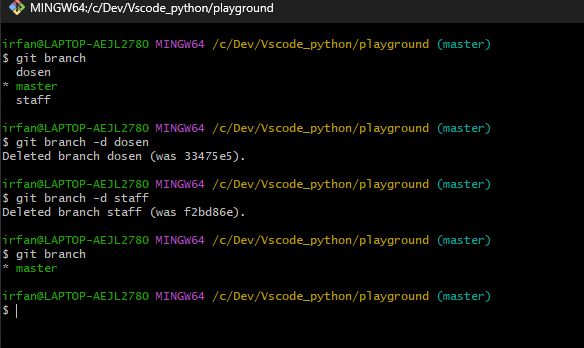

# Git Branch & Merge

Berikut adalah link sumber materi 6 ->
[Link Video 6](https://www.youtube.com/watch?v=EGl7KxVOyNs&list=PLFIM0718LjIVknj6sgsSceMqlq242-jNf&index=6)

## Table of Contents
  - [Implementasi Branch](#implementasi-branch)
    - [Command dalam Implementasi Branch](#command-dalam-implementasi-branch)
  - [Implementasi Merge](#implementasi-merge)
    - [Jenis Merge](#jenis-merge)
    - [Cara Menghapus Merge](#cara-menghapus-merge)
  - [Contoh Pengaplikasian Branch \& Merge](#contoh-pengaplikasian-branch--merge)

## Implementasi Branch
Dalam setiap commit yang dilakukan di dalam Git, Git memiliki mekanisme sendiri untuk mengetahui mana branch yang aktif dan mana yang merupakan commit terbaru, yaitu dengan pointer "Head". Pointer "Head" adalah pointer dalam Git yang menunjuk ke salah satu dari branch atau commit terakhir pada sebuah repository.

### Command dalam Implementasi Branch

- <b>Melihat branch mana yang aktif</b>

```sh
git branch
```

- <b>Membuat branch</b>

```sh
git branch <nama branch>
```

- <b>Melihat history commit</b>

```sh
git log
git log --all --decorate --oneline --graph

Untuk mempersingkat flag-flag di atas, kita buat perintah "alias"
alias graph="git log --all --decorate --oneline --graph"
```

- <b>Berpindah branch</b>

```
git checkout <nama branch>
```

## Implementasi Merge

### Jenis Merge

- Fast Forward Merge
<br>
Fast Forward Merge dilakukan jika branch yang ingin kita gabungkan berada di jalur langsung atau direct path. Berikut adalah command untuk merging

```
git merge <nama branch>
```

- Three-way Merge
Kebalikan dari Fast Forward Merge, metode Three-way Merge menggabungkan branch pada jalur yang tidak langsung atau indirect path. Dalam pengaplikasiannya, command yang digunakan tidak berubah secara syntax, yaitu

```
git merge <nama branch>
```

### Cara Menghapus Merge
Jika Anda telah melakukan merging dan tidak membutuhkan lagi suatu branch tertentu maka Anda bisa menghapusnya dengan command berikut

```
git branch -d <nama branch>
```
<br>

## Contoh Pengaplikasian Branch & Merge

1. Buatlah sebuah repository


1. Menambahkan file baru dan lakukan commit


1. Membuat dua branches


1. Menambahkan file pada branch dosen dan merge dengan cabang utama


1. Menambahkan file pada branch staff dan merge dengan cabang utama



1. Hapus branch dosen dan staff karena sudah tidak akan dipakai lagi
