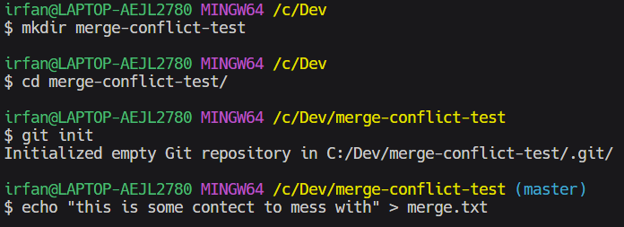
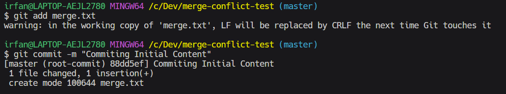
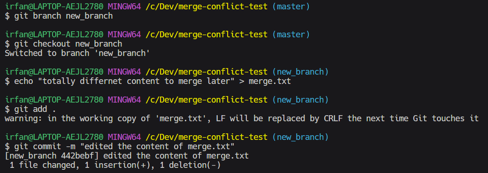
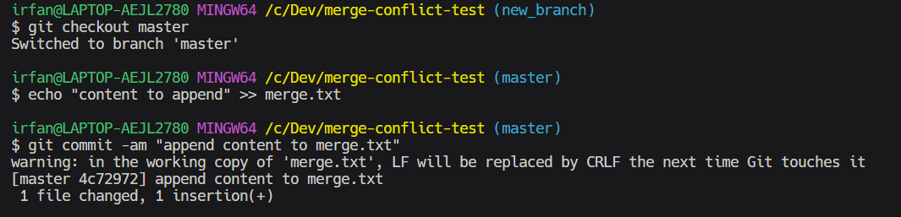
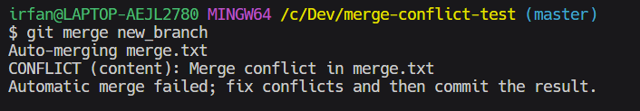
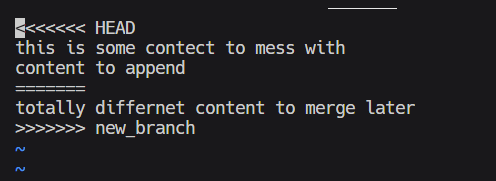
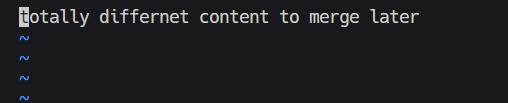
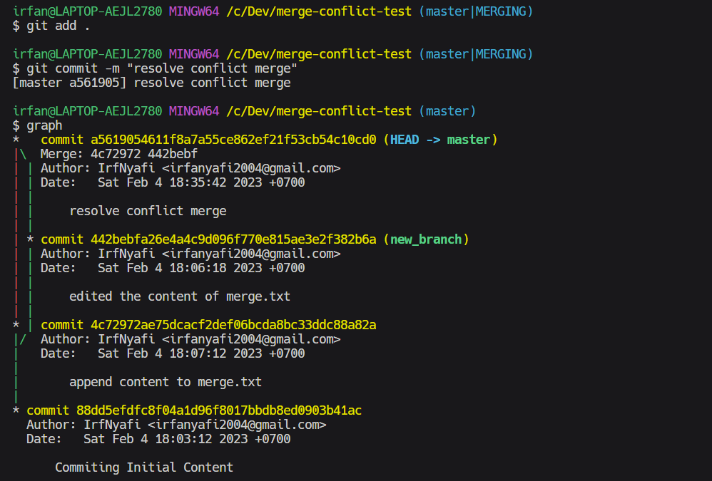

# Git Merge Conflict

Berikut adalah link sumber materi 7 ->
[Link Video 7](https://www.youtube.com/watch?v=Vfwfeve72PA&list=PLFIM0718LjIVknj6sgsSceMqlq242-jNf&index=7)

## Table of Contents
  - [Kapan Merge Conflict Terjadi](#kapan-merge-conflict-terjadi)
  - [Contoh Merge Conflict](#contoh-merge-conflict)

## Kapan Merge Conflict Terjadi

Merge conflict terjadi karena dua branch atau lebih mengerjakan baris yang sama pada satu repository.

## Contoh Merge Conflict

1. Buatlah sebuah repository
2. Tambahkan file dan lakukan komit


3. Buatlah branch baru dan rubah isi file didalamnya (untuk mengahasilkan conflict)
4. Lakukan staging dan commit

5. Kembali ke branch master dan lakukan merging


Didapatkan bahwa terdapat konflik saat merge
6. Kita akan resolve merge conflict, pertama-tama bukalah file tersebut

7. Pilihlah file mana yang akan di pakai atau dibuang, setelah itu, hapus jugalah hal berikut
```
<<<<<< HEAD

======

>>>>>> new_branch
```
Contohnya seperti berikut


8. Tambahkan file yang sudah di-resolve ke dalam staging area dan lakukan commit

Conflict merge berhasil di-resolve dan cabang new_branch berhasil merge dengan branch master