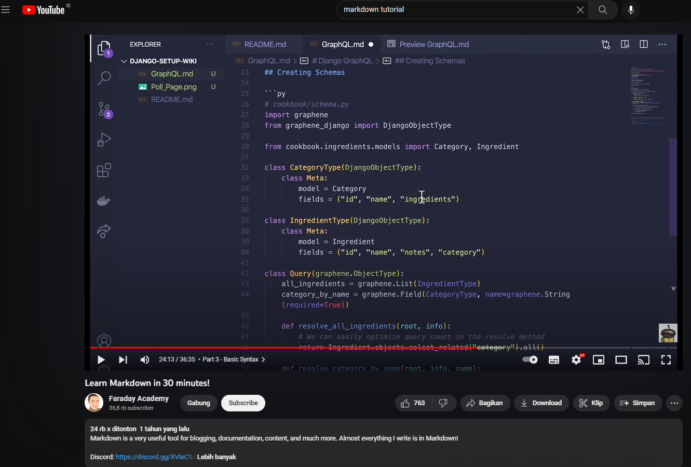

# Django GraphQL

Instruction for setting up Django project.

---

**Table of Content:**

- [Django GraphQL](#django-graphql)
  - [Why GraphQL?](#why-graphql)
  - [Graphene Installation](#graphene-installation)
  - [Roadmap](#roadmap)
  - [Foot Notes](#foot-notes)
  - [Footer](#footer)

## Why GraphQL?

- Get only the data that you want
- Easier to manage endpoint
  
## Graphene Installation

Install Graphene: `pip install django_graphene`

```py
import math

print("Hello mike")

for i in range(1,2):
    print(i)
```
---

> The secret of life is still a mistery.
>
> -- <cite>Anonim</cite> 

\
[](https://www.youtube.com/watch?v=bTVIMt3XllM&t=8s&ab_channel=FaradayAcademy)

## Roadmap

- [x] Task#1
- [ ] Task#2

| Name  | Current State | Next State |
| :---- | :------------ | :--------- |
| Green | Yellow        | Blue       |
| Green | Yellow        | Blue       |

<details>
<summary>Section Header</summary>

Section body text.

- Hello
- test

</details>

<br>

## Foot Notes

Happy trees are happy [^1]

## Footer
[^1]:By Bob Ross
